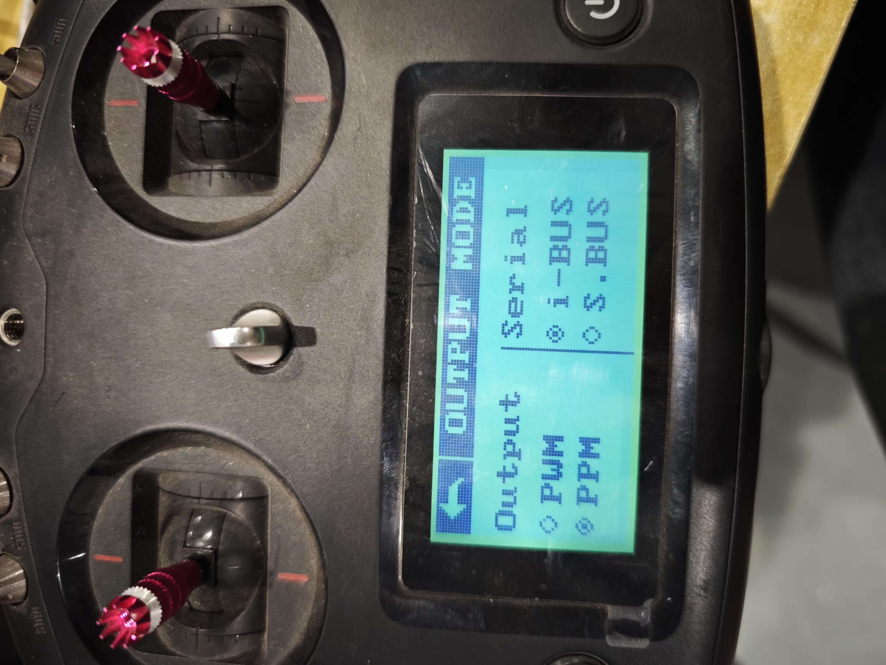
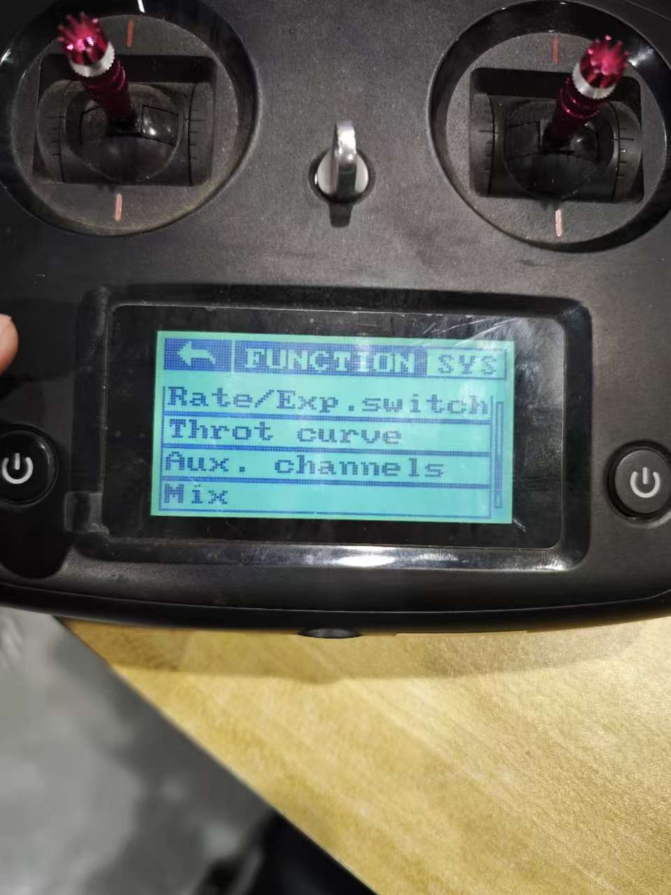
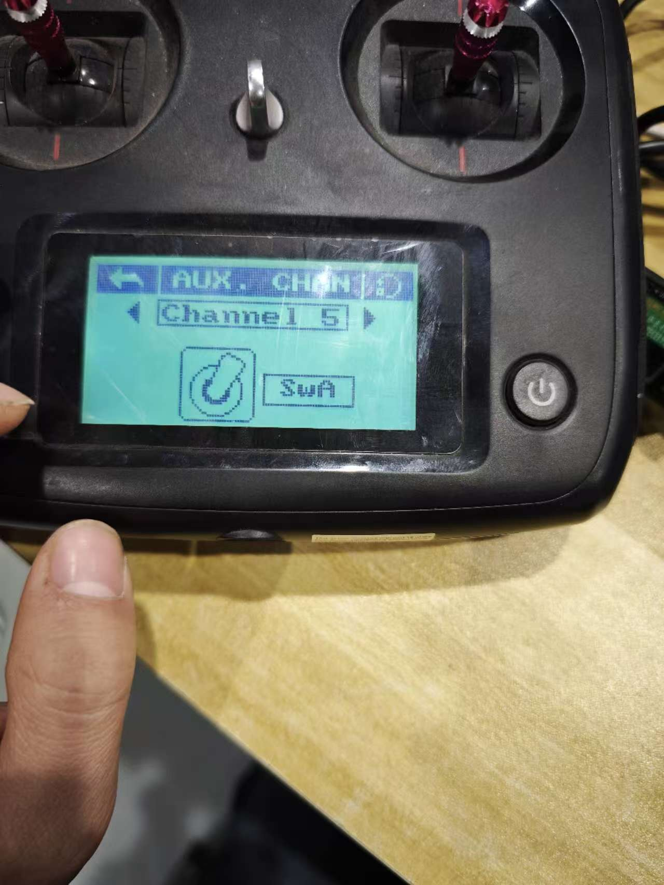
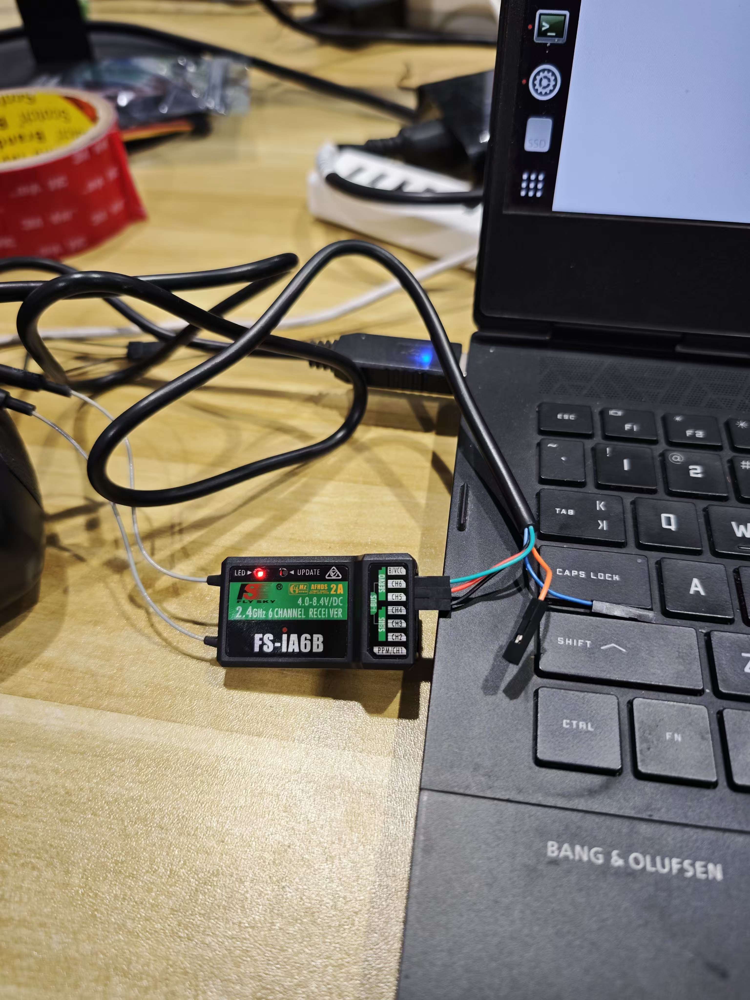

# 富斯遥控器 i6S 控制 ROS 机器人

## 背景

在 ROS 机器人控制中，北通遥控手柄可以方便地向底盘发送 `/cmd_vel` 指令，但受限于蓝牙或 2.4G 连接，控制距离较短，仅能维持十几秒。而航空遥控器（如富斯遥控器）覆盖范围可达几百米，因此希望使用航空遥控器来替代手柄进行远程控制。

## 准备工具
- **富斯遥控器 i6S**
- **接收机 iA6B**
- **TTL 转 USB 线**

- **FS-i6S 使用说明书**

- **实物图**

## 操作步骤

### 1. 遥控器和接收机对码

- 接收机 **5V 供电**，短接 **B/VCC**。
- 接收机 **红灯闪烁**，表示等待对码。
- 打开富斯遥控器，进入 **设置** -> **System** -> **RX Bind**，等待对码完成。
- 对码成功后，接收机红灯 **常亮**。
![实物图]（/images/微信图片_20250303134810.jpg）

参考视频：[Bilibili 教程](https://www.bilibili.com/video/BV1Qy4y127NU/?spm_id_from=333.337.search-card.all.click)

### 2. iBus 输出设置

- 进入 **设置** -> **System** -> **Output Mode**
- 选择 `Serial`，并设置为 `i-BUS`


### 3. 添加通道

默认情况下，遥控器仅支持 **4 个通道**，但我们希望增加更多通道以映射额外的按键。

- 进入 **设置** -> **Function** -> **Aux Channels**
- 添加 **通道 5、6、7、8、9、10**
- 这些通道可以映射 **SWA、SWB、SWC、SWD 以及按键 A 和 B**，用于后续功能拓展。
 
  

### 4. 连接接收机 iBus 输出

- 使用 **i-BUS 接口** 进行连接。
- 连接方式如下：
  - **地线 (GND)**
  - **VCC (5V 电源)**
  - **信号线 (iBUS 数据)**


- 通过 `cutecom` 读取输出：
  ```bash
  sudo cutecom
  ```
  - 设置波特率为 **115200**
！[读取数据](FS-i6S-ROS-Control/images/微信图片_20250303140808.jpg)

### 5. 编写 iBus 解析脚本

使用 Python 解析 iBus 数据，并映射到虚拟手柄，进而用于 ROS 控制。

#### 代码示例 (`yaokon.py`)

```python
import uinput
import serial

# 连接 iBUS 设备
ser = serial.Serial('/dev/ttyUSB0', 115200, timeout=1)

# 创建虚拟手柄
device = uinput.Device([
    uinput.ABS_X + (-32768, 32767, 0, 0),
    uinput.ABS_Y + (-32768, 32767, 0, 0),
    uinput.BTN_A,
    uinput.BTN_B,
])

while True:
    data = ser.read(32)  # 读取 iBUS 数据
    if len(data) == 32:
        # 解析数据并映射到手柄
        x = int.from_bytes(data[6:8], 'little')
        y = int.from_bytes(data[8:10], 'little')
        device.emit(uinput.ABS_X, x - 1500)
        device.emit(uinput.ABS_Y, y - 1500)
```

运行脚本：
```bash
sudo -E python3 yaokon.py
```

可能需要安装 `uinput`:
```bash
pip3 install python-uinput
```

### 6. 运行 ROS 手柄节点

检查虚拟手柄是否创建成功：
```bash
ls /dev/input/
```
如果 `js0` 设备存在，则继续运行 ROS 手柄节点：
```bash
rosrun joy joy_node _dev:=/dev/input/js0
```

订阅 `joy` 话题，查看是否有数据：
```bash
rostopic echo /joy
![查看话题]（/images/Screenshot from 2025-03-03 14-23-10.png）
```

### 7. 测试和完成

现在可以通过富斯遥控器 i6S 控制 ROS 机器人，并发送 `/cmd_vel` 话题控制底盘移动！

